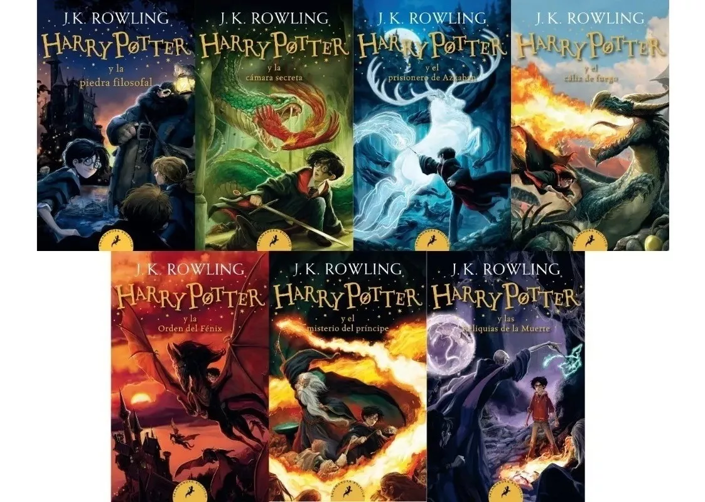
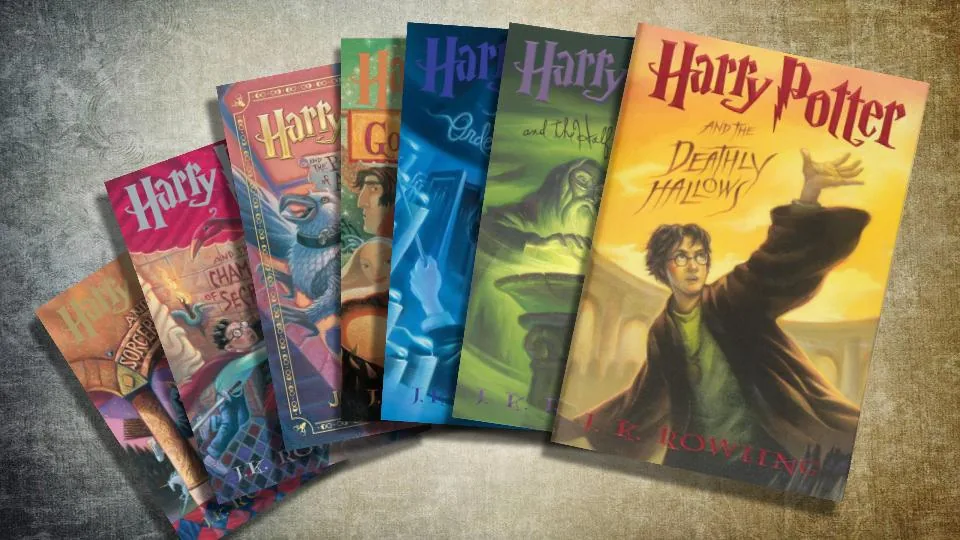

# 📚 Análisis de Texto de la Saga de Harry Potter 🧙‍♂️




### Descripción del Proyecto

Este proyecto realiza un análisis del texto completo de los siete libros de la saga Harry Potter mediante técnicas de minería de datos 
y análisis de sentimientos. El objetivo principal es extraer patrones, identificar palabras clave y explorar las emociones de los personajes lo que permita una comprensión más profunda de esta icónica obra literaria.

A través del uso de R y librerías especializadas, este análisis se desarrolla utilizando métodos de preprocesamiento de texto, 
extracción de temas, análisis de redes semánticas y más.

### Objetivos del Proyecto

* Procesar y limpiar los textos de los libros para obtener datos estructurados listos para su análisis.
* Identificar palabras frecuentes, temas recurrentes y asociaciones de términos clave.
* Visualizar patrones textuales mediante gráficos y nubes de palabras.
* Implementar análisis de sentimientos, modelado de tópicos y estudio de frecuencias.
* Analizar la distribución de emociones entre los personajes principales y compararlas a lo largo de los diferentes libros de la saga.
* Descubrir patrones emocionales que ofrezcan un entendimiento más profundo de los textos.


## Tabla de Contenidos:

[1. Preguntar](https://github.com/silvagrino/Harry-Potter-text-mining?tab=readme-ov-file#1-preguntar)

[2. Preparar](https://github.com/silvagrino/Harry-Potter-text-mining?tab=readme-ov-file#2-preparar)

[3. Procesar](https://github.com/silvagrino/Harry-Potter-text-mining?tab=readme-ov-file#3-procesar)

[4. Analisis](https://github.com/silvagrino/Harry-Potter-text-mining?tab=readme-ov-file#4-analisis)

[5. Compartir](https://github.com/silvagrino/Harry-Potter-text-mining?tab=readme-ov-file#5-compartir)

[6. Actuar](https://github.com/silvagrino/Harry-Potter-text-mining/tree/main?tab=readme-ov-file#6-actuar)


# 1. Preguntar

Preguntas que guiarán el análisis

* ¿Cómo evolucionan los temas y emociones a lo largo de los libros de la saga?

* ¿Qué palabras y sentimientos se asocian con los personajes principales?

* ¿Qué patrones emocionales y tópicos predominan en los libros y personajes?


# 2. Preparar

* Fuente de Datos: 8 Archivos PDF de la saga de libros Harry Potter.
 Constituido por 7 archivos individuales para cada libro de la saga y un archivo que contiene la saga completa.

Los datos de la saga fueron procesados desde texto (formato PDF/TXT) utilizando librerías como pdftools y tm.

### Cantidad de palabras 
```
# Lista de libros
conteo_palabras <- sapply(librostext, function(libro) {
  texto_completo <- paste(libro, collapse = " ")
  
  palabras <- unlist(strsplit(texto_completo, "\\s+"))
  length(palabras)
})
# Mostrar el total de palabras por libro
names(conteo_palabras) <- paste("Libro", 1:length(texto_libros))
print(conteo_palabras)
```

* Harry Potter y la piedra filosofal: 781.865 palabras.
* Harry Potter y la cámara secreta: 91.422 palabras.
* Harry Potter y el prisionero de Azkaban: 110.080 palabras.
* Harry Potter y el cáliz de fuego: 199.881 palabras.
* Harry Potter y la Orden del Fénix: 278.698 palabras.
* Harry Potter y el misterio del príncipe: 175.260 palabras.
* Harry Potter y las reliquias de la muerte: 208.902 palabras.

### Para preparar los datos aplicaré un Enfoque ROCCC:

**R**eliable/Confiablilidad: Famosa saga de libros escritos por la autora J. K. Rowling. 

**O**riginal/Originalidad: Datos originales obtenidos directamente de los libros

**C**omprehensive/Integralidad: Texto extraído de los libros de Harry Potter, saga consistente en 7 libros 

**C**urrent/Actuales: Exitosa saga estrenada en 30 de junio de 1997 que finalizo con su último libro en 21 de julio de 2007.

**C**ited/Citación: No es necesaria

### Herramientas:

* R para la minería de texto, análisis y visualización.
Librerías principales: 

library(ggplot2) 
library(reshape2)   
library(tidyr)    
ibrary(wordcloud) 
library(igraph) 

* Análisis avanzado:

library(topicmodels) 
library(syuzhet) 
 

# 3. Procesar

Preprocesamiento de Texto:

Creo un corpus para limpiar los textos, entre los cambios que aplicaré al texto original se encuentran:
Convertir a minúsculas.
Eliminar puntuación y números.
Remover palabras irrelevantes (stopwords) en español.
Remover palabras y caracteres especiales. 

Comienzo a procesar los archivos, incluyéndolos a una lista PDF, para luego iterar sobre ella y crear el corpus para cada libro

```
    corpus <- Corpus(VectorSource(texto))
    corpus <- tm_map(corpus, content_transformer(tolower))
    corpus <- tm_map(corpus, removePunctuation)
    corpus <- tm_map(corpus, removeNumbers)
    corpus <- tm_map(corpus, removeWords, stopwords("spanish"))
    corpus <- tm_map(corpus, stripWhitespace)

    corpus <- tm_map(corpus, content_transformer(function(x) gsub("—", "", x)))
    corpus <- tm_map(corpus, content_transformer(function(x) gsub("—¿", "", x)))
    corpus <- tm_map(corpus, content_transformer(function(x) gsub("—¡", "", x)))
    corpus <- tm_map(corpus, content_transformer(function(x) gsub("—dijo", "", x)))
    corpus <- tm_map(corpus, content_transformer(function(x) gsub("dijo", "", x)))
    corpus <- tm_map(corpus, content_transformer(function(x) gsub("preguntó", "", x)))
```

Limpio además signos especiales y palabras típicos de una narración como esta, las cuales se repetirán mucho.

# 4. Análisis


Creo la matriz de términos-documentos para poder calcular la frecuencia de términos para cada libro.
Para ello creo un bucle para procesar cada archivo, así no tendré que repetir el código para cada uno de los 8 archivos.

```
  for (i in 1:8) {
    # Crear nombres dinámicos para los objetos
    nombre_corpus <- paste0("HP_", i)
    nombre_tdm <- paste0("tdm_", i)
    nombre_frecuencia <- paste0("frecuencia_ordenada", i)
    nombre_resultado <- paste0("corpus_filtrado_ordenado", i)
    
    corpus <- get(nombre_corpus)  

    tdm <- TermDocumentMatrix(corpus)
    
    # Calcular la frecuencia de términos
    frecuencia_terminos <- rowSums(as.matrix(tdm), na.rm = TRUE)
    frecuencia_ordenada <- sort(frecuencia_terminos, decreasing = TRUE)
    
    # Crear el data frame con los términos y sus frecuencias
    resultado <- data.frame(
      palabra = names(frecuencia_ordenada),
      frec = frecuencia_ordenada
    )
    
    # Asignar los objetos
    assign(nombre_tdm, tdm)  
    assign(nombre_frecuencia, frecuencia_ordenada)  
    assign(nombre_resultado, resultado)  
  }
```

Esta frecuencia de términos para toda la saga me permite hacer varios análisis relacionados con la frecuencia de palabras


## Frecuencia de palabras

### Nube de palabras para saga completa
  
```
  wordcloud(words = corpus_filtrado_ordenado8$palabra, 
            freq = corpus_filtrado_ordenado8$frec, 
            max.words = 80,                              
            random.order = F, 
            colors = brewer.pal(name = "Dark2", n = 8))
```


Como cabria esperar, la palabra más repetida es "Harry Potter", protagonista de esta saga junto con Ron y Hermione, el trío protagonista y los demás personajes secundarios presentes en toda la saga.


## Nube de palabras para libro 1 y 3


   


* Harry Potter y la piedra filosofal

 Introduce a los personajes, el entorno escolar (Hogwarts) y elementos básicos de la magia, con un tono de descubrimiento y asombro.

* Harry Potter y el prisionero de Azkaban

Presenta una narrativa más compleja y madura respecto a sus antecesores, con nuevos personajes (Lupin, Black, Sirius) y temas oscuros como los dementores y las traiciones (Scabbers y Pettigrew).

Si bien Harry sigue siendo el centro de la historia, este 3er libro amplía el protagonismo de otros personajes clave como Lupin y Sirius Black.


## Gráficas de frecuencia libro 2 y 4
  

```
  corpus_filtrado_ordenado8[1:13, ] %>%
    ggplot(aes(palabra, frec)) +
    geom_bar(stat = "identity", color = "black", fill = "#87CEFA") +                       
    geom_text(aes(hjust = 1.3, label = frec)) + 
    coord_flip() + 
    labs(title = "Trece palabras más frecuentes",  x = "Palabras", y = "Número de usos")
```  


* Harry Potter y la cámara secreta


El trío protagonista es lo que más se repite en este libro, así como en todo el resto de la saga.
 En este segundo libro todavía se están explorando personajes que tendrán una presencia permanente. También vemos la presencia de un personaje que solo aparece en esta entrega; Lockhart.

* Harry Potter y el cáliz de fuego


Moody nuevo personaje que se presenta y que participa en parte importante del libro. La inusual cantidad de veces que se repite la palabra Señor puede
estar dado por el regreso de Voldemort y la relación con Peter Pettigrew.

## Porcentaje de uso de palabras libros 5 y 7

```
  corpus_filtrado_ordenado5 %>%
    mutate(perc = (frec/sum(frec))*100) %>%
    .[1:13, ] %>%
    ggplot(aes(palabra, perc)) +
    geom_bar(stat = "identity", color = "black", fill = "#87CEFA") +                   
    geom_text(aes(hjust = 1.3, label = round(perc, 2))) + 
    coord_flip() +
    labs(title = "Trece palabras más frecuentes", x = "Palabras", y = "Porcentaje de uso")
```


* Harry Potter y la Orden del Fénix


Gran presencia de profesora Umbridge y la consolidación de la relación de Harry con Sirius


* Harry Potter y las reliquias de la muerte


El conflicto de las varitas y como Voldemort trata de obtener la varita de saúco, tiene presencia en la séptima entrega y se ve representado por la frecuencia de las palabras varita y Voldemort.


## Asociaciones de palabras saga

Selecciono palabras clave para ver sus asociaciones a través de toda la saga. Aplicaré un índice de asociación de 0.18

```
  findAssocs(tdm_8, terms = c("magia", "hogwarts", "harry", "ron", "dumbledore", "hermione", "hagrid", "snape", "voldemort", "malfoy", "potter", "varita"), corlimit = .18) 
  ```


### Agrupaciones Temáticas por Personajes y Conceptos:

Los términos asociados con cada personaje o concepto clave revelan el contexto y las relaciones narrativas predominantes. Por ejemplo:

- Dumbledore se asocia con "director," lo que refuerza su rol administrativo y de liderazgo en Hogwarts.

- Hagrid incluye términos como "cabaña," "guardabosques," y "criaturas," resaltando su vínculo con la naturaleza y las criaturas mágicas.

- Snape se relaciona con términos como "profesor," "grasiento," y "despacho," lo que refleja descripciones físicas y su papel como docente.

### Palabras Clave para Entender Conceptos Abstractos:

- Magia se vincula con "ministerio," "ministro," y "hechicería," lo que señala el marco institucional y regulador de la magia en el universo narrativo.

- Varita se relaciona con términos técnicos como "saúco," "ollivander," y "núcleo," mostrando un interés en las propiedades mágicas y simbólicas de las varitas.

### Relaciones Narrativas y Emocionales:

- Los términos asociados a Voldemort como "mortífagos," "conectadas," y "morir" apuntan a sus conexiones oscuras y su centralidad como antagonista.

- Harry y sus asociaciones ("vio") reflejan su papel de observador y protagonista en situaciones clave.

### Diferencias en el Grado de Especificidad:

- Algunos conceptos como "Hogwarts" están relacionados con términos más amplios ("colegio," "expreso"), mientras que otros, como "Malfoy," muestran interacciones específicas con aliados (e.g., "crabbe," "goyle").


## Análisis de Redes Semánticas

  ### Modelado de Tópicos
  
 Para este modelado de tópicos haré uso de LDA (Latent Dirichlet Allocation) para identificar temas latentes y la construcción de grafos basados en la co-ocurrencia de palabras clave.
Es importante compartir este código para que el usuario pueda interactuar con este gráfico y explorar las múltiples opciones que ofrece para las relaciones de esta red semántica.

 ```
  # Imprimir los temas por libro
  names(temas_por_libro) <- c("Libro1", "Libro2", "Libro3", "Libro4", "Libro5", "Libro6", "Libro7")
  
  for (libro in names(temas_por_libro)) {
    cat("\nTemas para", libro, ":\n")
    print(temas_por_libro[[libro]])
  }
  ```


  ```
  # Crear datos para visualización LDA

  datos_vis <- lapply(1:length(resultados_lda), function(i) {
    modelo <- resultados_lda[[i]]  
    dtm <- lista_dtm[[i]]  
    
    createJSON(
      phi = posterior(modelo)$terms, 
      theta = posterior(modelo)$topics,  
      doc.length = rowSums(as.matrix(dtm)),  
      vocab = colnames(as.matrix(dtm)), 
      term.frequency = colSums(as.matrix(dtm)) 
    )
  })
  
  # Visualizar para un libro (3)
  serVis(datos_vis[[3]], open.browser = TRUE)
  
```


### Harry Potter y la Orden del Fénix


El análisis de las burbujas temáticas muestra cómo los tópicos identificados se distribuyen de manera significativa en torno a eventos y personajes clave del libro:

* Tópico relacionado con la profesora Umbridge: Una de las burbujas más prominentes representa a la profesora Umbridge, cuyo papel central en este libro genera múltiples conexiones, como su influencia en Hogwarts y sus interacciones con los estudiantes. Su alta frecuencia en el texto refleja su antagonismo y relevancia en la narrativa.

* Bosque prohibido: Muy cercana a la burbuja de Umbridge, otra representa eventos en el bosque prohibido. Esta proximidad semántica subraya cómo el bosque está relacionado con las acciones y decisiones de Umbridge, destacando su presencia en momentos clave, como el castigo de los estudiantes y la exploración de la resistencia contra su autoridad.

* Arco narrativo previo al año escolar: Otro tópico destacado agrupa eventos previos al inicio del año escolar de Harry. Incluye interacciones con sus tíos, Sirius y las preparaciones antes de su llegada a Hogwarts. Este tópico captura la transición narrativa entre el mundo muggle y el mágico.

* La profecía y el Ministerio de Magia: Una burbuja importante refleja la profecía, Neville, y la visita al Ministerio de Magia. Este tópico abarca temas cruciales para el desarrollo de la trama, como el enfrentamiento final y la importancia de los personajes secundarios en la batalla.


### Harry Potter y el misterio del príncipe


* Familia Gaunt y recuerdos de Voldemort:
La burbuja apartada representa los recuerdos de Voldemort relacionados con su ascendencia y la familia Gaunt. Este tópico es clave para comprender el origen de los Horrocruxes y la conexión entre Voldemort y su linaje.

* Relación entre Harry y Slughorn:
Un tópico importante está dedicado a la relación entre Harry y el profesor Slughorn. Este abarca las interacciones en torno a la obtención del recuerdo crítico sobre el Horrocrux y la importancia de las pociones, incluyendo el uso del libro de texto del "Príncipe Mestizo".

* La cabaña de Hagrid y Aragog:
Otro tópico refleja los eventos relacionados con Hagrid, la muerte de Aragog y el funeral de la acromántula, que se conecta directamente con la obtención de información clave de Slughorn debido a la influencia del Felix Felicis.

* Sala de los Menesteres, Dobby y Malfoy:
Dos burbujas muy cercanas reflejan eventos interrelacionados:

- La Sala de los Menesteres, utilizada por Malfoy para preparar el armario evanescente y facilitar la entrada de los mortífagos a Hogwarts.
- La participación de Dobby, que ayuda a Harry a investigar las actividades de Malfoy.
Esta proximidad refleja la tensión y el espionaje en torno a las acciones de Malfoy durante el año escolar.

* Narcisa Malfoy y los Weasley:
Otro tópico representa a Narcisa Malfoy, especialmente su juramento inquebrantable con Snape, y los conflictos entre los Malfoy y los Weasley. La presencia de estos personajes destaca la rivalidad familiar y los dilemas éticos que afectan los eventos del libro.


### Harry Potter y las reliquias de la muerte


Una burbuja enlaza temas como el valle de Godric y Dumbledore.
Temas relacionados con variedad de nombres que se presentan hasta que Harry parte de casa de sus tíos.
Tema relacionado con Olivander, la varita de saúco y los horrocruxes. El resto son 2 burbujas variadas que tienen que ver con kreacher, Regulus, prisioneros, iglesia, estatuas y paredes.

* Godric's Hollow y Dumbledore:
Una burbuja temática engloba elementos relacionados con el Valle de Godric, la historia de Dumbledore y los secretos revelados sobre su pasado. Este tópico destaca la exploración de Harry y Hermione en busca de pistas sobre los Horrocruxes y los momentos clave en este lugar, incluyendo la visita a la tumba de los Potter.

* Inicio del Viaje de Harry:
Otro tópico captura eventos y personajes que aparecen antes de que Harry abandone la casa de los Dursley, incluyendo la aparición de personajes clave como Kingsley y los Weasley, así como los preparativos para la boda de Bill y Fleur. Estos eventos sientan las bases de la narrativa que sigue.

* Ollivander, la Varita de Saúco y los Horrocruxes:
Este tema se centra en la importancia de Ollivander, la Varita de Saúco y la búsqueda de los Horrocruxes. La conexión con Grindelwald, Bellatrix y Voldemort refleja la búsqueda de poder y los enfrentamientos cruciales en la historia.

* Kreacher, Regulus y la Resistencia:
Una de las burbujas variadas abarca la historia de Kreacher, el sacrificio de Regulus Black, y el papel del elfo doméstico en la recuperación del relicario Horrocrux. También se vincula con elementos de resistencia en contra del régimen de Voldemort.

* Estatuas, Paredes y Prisioneros:
Otra burbuja temática refleja los eventos en la iglesia, las estatuas y las paredes, posiblemente haciendo referencia al escape del Ministerio de Magia y las condiciones de los prisioneros en la mansión Malfoy. Este tema incluye momentos de acción y rescate.


## Análisis de sentimientos

### Personajes principales, emociones y polaridades asociadas.

¿Qué espero obtener de este análisis?

Distribución emocional: Cómo varían las emociones (miedo, tristeza, alegría, etc.) en cada libro.

Tono general: Identificar si un libro es más positivo o negativo en términos emocionales.

Evolución narrativa: Analizar cómo las emociones cambian a lo largo de la saga, reflejando el desarrollo de la trama.

  
##  Evaluar emociones y polaridad en los textos.

```
install.packages("syuzhet")
library(syuzhet)
```

El paquete syuzhet para análisis de sentimientos incluye el lexicón NRC, que evalúa 8 emociones (alegría, tristeza, miedo, etc.) y la polaridad (positivo/negativo).

```
  resultados_emociones <- lapply(texto_libros, function(texto) {
    get_nrc_sentiment(texto)
  })
  
  # Plot Barra de columnas
  
  barplot(colSums(resultados_emociones[[8]]), las = 2, col = rainbow(10),
          main = "Distribución de emociones en la saga")
```


Se ve una distribución de emociones relativamente equilibrada, pero se tiende a tener más emociones negativas, probablemente representadas en los libros que presentan temáticas más oscuras y relacionadas con la muerte que resultan ser los libros más largos de la saga.

### Comparación entre libros de la saga


La visualización revela que un fuerte enfoque en confianza (trust) y tristeza (sadness) dominan la narrativa. Aunque hay momentos de alegría y sorpresa, son opacados por las emociones más intensas que definen el tono emocional de Harry Potter.


### Análisis de la polaridad. Comparación entre libros:

  ```
  polaridad <- sapply(resultados_emociones, function(emociones) {
    sum(emociones$positive) - sum(emociones$negative)
  })
  
  # Plot

  barplot(polaridad, names.arg = paste("Libro", 1:8), col = "blue",
          main = "Polaridad general por libro")
```


* "Libro  8" representa la saga completa.

En este gráfico se puede ver de manera más explícita la diferencia entre de polaridades entre los diferentes libros.
Los 3 primeros libros son los más positivos de la saga, la cual gradualmente se van haciendo más oscura. En el 4.º la diferencia es mucha, esto tiene sentido al considerar que en este libro Voldemort vuelve y se presenta la primera muerte significativa que Harry presencia, la muerte de Cedric Diggory.


```
polaridad_libros <- data.frame(
  Polaridad = c("Positiva", "Negativa"),
  Frecuencia = colSums(do.call(cbind, lapply(resultados_emociones, function(em) em[, c("positive", "negative")]))),
  Libro = rep(paste("Libro", 1:length(librostext)), each = 2)
)

ggplot(polaridad_libros, aes(x = Libro, y = Frecuencia, fill = Polaridad)) +
  geom_bar(stat = "identity", position = "dodge") +
  scale_fill_manual(values = c("steelblue", "tomato")) +
  labs(title = "Polaridad emocional por libro",
       x = "Libro",
       y = "Frecuencia de polaridad") +
  theme_minimal()
```


* El "libro 8" representa la saga completa

El 5.º libro se presenta como uno mucho más positivo, no hay muertes y Harry toma más autonomía y liderazgo al crear la Orden del Fénix. El 6.º libro vuelve a tener una polaridad más negativa con respecto a su antecesor, aunque no tanto como el 4.º. Este libro presenta temáticas más profundas relacionadas con el pasado de Voldemort, sus recuerdos, los Horrocruxes y la muerte de Dumbledore.
Finalmente, el 7to libro es el libro con la polaridad más negativa de la saga, esto debido a que se presentan situaciones relacionadas a la muerte, el sacrificio de parte de Harry, la destrucción de los horrocruxes, y finalmente la ballata de Hogwarts la cual presenta la mayor cantidad de muertes.

La consistencia de estas emociones refleja un patrón recurrente en la saga de Harry Potter, donde momentos oscuros se equilibran con esperanza y momentos alegres.


## Emociones por personajes 

### Grafico circular

```
 ggplot(datos_harry, aes(x = "", y = Frecuencia, fill = Emocion)) +
    geom_bar(stat = "identity", width = 1, color = "white") +
    coord_polar(theta = "y") +
    scale_fill_manual(values = colores_emociones) +
    geom_text(aes(label = paste0(Porcentaje, "%")), 
              position = position_stack(vjust = 0.5),  # Centrar etiquetas en los segmentos
              size = 3) +  # Tamaño de las etiquetas
    ggtitle("Distribución de emociones para Harry") +
    theme_void()
```


### Comparación entre personajes principales


### Distribución General de Emociones

* Harry, Ron y Hermione (El Trío Protagonista)

Harry muestra un equilibrio entre emociones positivas y negativas, con una proporción notable de fear y trust. Esto resalta la naturaleza de su papel como protagonista, enfrentando constantes amenazas pero manteniendo la confianza en su misión.

A diferencia de otros personajes como Dumbledore o Harry, Hermione presenta una proporción más baja de "trust". Esto podría interpretarse como una representación de su carácter más crítico y racional, donde confía más en su conocimiento y habilidades personales que en los demás.

Ron presenta un patrón similar al de Hermione, pero con una mayor representación de fear y negative, lo cual podría reflejar sus momentos de inseguridad y desafíos personales.

* Dumbledore

Trust y positive son las emociones predominantes en Dumbledore. Esto es coherente con su rol como líder sabio y mentor de los protagonistas, quien inspira confianza y esperanza incluso en los momentos más oscuros.

* Snape

Snape tiene una proporción más alta de trust y sadness.
Tiene un papel ambiguo y oscuro en la historia.
La emoción sadness puede estar relacionada con los aspectos trágicos de su vida, como su amor no correspondido y sacrificios personales.
La presencia de trust es relevante, ya que finalmente se revela como un aliado crucial, a pesar de su apariencia hostil.

* Voldemort

Voldemort presenta una notable cantidad de fear, negative, y anger, lo cual es lógico considerando su rol como antagonista principal de la saga.
La anger (ira) y negative (negatividad) dominan su espectro emocional, lo que refleja su naturaleza violenta y vengativa.
La alta presencia de fear podría interpretarse no solo como el miedo que él causa, sino también como su propio temor a la muerte y a perder el poder.
También Voldemort es el personaje que presenta la menor cantidad de surprise, siendo casi nula respecto a los demás, esto se interpreta como su poca capacidad para descubrir nuevas cosas, de actuar con curiosidad.
No así como personajes más sabios como lo son Dumbledore que están dispuestos a admitir su ignorancia cuando se amerita, llevándolo a buscar soluciones y replantearse sus puntos de vista.


* Conclusiones Generales

Los protagonistas (Harry, Hermione y Ron) mantienen un balance entre emociones positivas y negativas, con una fuerte presencia de trust (confianza), lo que refuerza el tema de amistad y trabajo en equipo.
Dumbledore encarna la sabiduría y la esperanza, mientras que Snape es un personaje marcado por la tristeza y la ambigüedad emocional.

Voldemort, como villano principal, está definido por emociones negativas como anger y fear, destacando su papel como fuente de conflicto en la saga.
La comparación revela cómo las emociones reflejan la construcción narrativa de cada personaje, alineando sus emociones dominantes con sus arcos de desarrollo en la historia.


# 5. Conclusión


El análisis de la saga de Harry Potter mediante minería de texto y análisis de emociones revela patrones claros que reflejan tanto la
 evolución temática de los libros como la construcción emocional de sus personajes principales.

Las asociaciones no solo muestran las conexiones directas entre personajes y conceptos, sino que también permiten identificar patrones narrativos
 y dinámicas clave. Estos hallazgos pueden ser utilizados para explorar cómo se desarrolla la narrativa, qué términos dominan ciertas temáticas,
  y cómo los personajes y conceptos están interrelacionados a lo largo de la saga.


### Evolución Temática

* Libros Iniciales: Presentan un tono más positivo y de descubrimiento, con emociones predominantes como alegría y sorpresa. Esto es
 coherente con la introducción de los personajes y el mundo mágico.
* Libros Finales: Muestran un incremento en emociones negativas como miedo, tristeza e ira, reflejando los desafíos, pérdidas y conflictos
 que caracterizan el clímax de la historia.

### Personajes Principales

* Harry Potter: Un balance entre tristeza y miedo, pero con una constante presencia de confianza, reflejando su papel como héroe enfrentando adversidades.
* Hermione Granger: Predomina la confianza, lo que resalta su naturaleza racional y su rol como solucionadora en el trío protagonista.
* Voldemort: Definido por emociones negativas como ira y disgusto, representando su papel como el antagonista principal, con un énfasis en el miedo, tanto el que infunde como el que lo domina internamente.
* Dumbledore: Encarnación de confianza y esperanza, consistente con su papel como mentor y figura de liderazgo.

### Implicaciones

Estos hallazgos exponen cómo las emociones y patrones textuales se utilizan narrativamente para construir personajes memorables y reforzar
 los temas centrales de la saga. El equilibrio entre emociones positivas y negativas a lo largo de los libros resalta el contraste entre los 
 momentos oscuros y las resoluciones esperanzadoras que caracterizan a Harry Potter como una historia de perseverancia y redención.

Los personajes principales tienen perfiles emocionales únicos que contribuyen a su caracterización y gradual complejidad.

El análisis también demuestra el valor de aplicar técnicas de minería de texto a obras literarias, no solo para desentrañar patrones ocultos,
 sino también para ofrecer una comprensión más profunda de las narrativas y sus impactos emocionales en los lectores.


