# 📚 Análisis de Texto de la Saga de Harry Potter 🧙‍♂️


## Tabla de Contenidos:

[1. Preguntar](https://github.com/silvagrino/Harry-Potter-text-mining?tab=readme-ov-file#1-preguntar)

[2. Preparar](https://github.com/silvagrino/Harry-Potter-text-mining?tab=readme-ov-file#2-preparar)

[3. Procesar](https://github.com/silvagrino/Harry-Potter-text-mining?tab=readme-ov-file#3-procesar)

[4. Analisis](https://github.com/silvagrino/Harry-Potter-text-mining?tab=readme-ov-file#4-analisis)

[5. Compartir](https://github.com/silvagrino/Harry-Potter-text-mining?tab=readme-ov-file#5-compartir)

[6. Actuar](https://github.com/silvagrino/Harry-Potter-text-mining/tree/main?tab=readme-ov-file#6-actuar)


Estructura del Proyecto
Metodología
Análisis de Emociones
Comparación de Personajes
Comparación de Libros
Resultados
Conclusiones y Extensiones


### Descripción del Proyecto

Este proyecto realiza un análisis del texto completo de los siete libros de la saga Harry Potter mediante técnicas de minería de datos 
y analisis de sentimientos. El objetivo principal es extraer patrones, identificar palabras clave, explorar características 
lingüísticas y las emociones de personajes que permitan una comprensión más profunda de esta icónica obra literaria.

A través del uso de R y librerías especializadas, este análisis se desarrolla utilizando métodos de preprocesamiento de texto, 
extracción de temas, análisis de redes semánticas y más.

# Objetivos del Proyecto

Procesar y limpiar los textos de los libros para convertirlos en datos estructurados listos para análisis.

Identificar palabras frecuentes, temas recurrentes y asociaciones de términos clave.

Visualizar patrones en el texto mediante gráficas, nubes de palabras y diagramas.

Proponer nuevos enfoques analíticos, incluyendo análisis de sentimientos, modelado de tópicos y frecuencias.

Objetivos del Proyecto
Visualizar la distribución de emociones entre los personajes principales.
Comparar las emociones presentes en los diferentes libros de la saga.
Descubrir patrones emocionales que puedan aportar un entendimiento más profundo de los textos.


# 1. Preguntar

-Como cambia la saga a traves de los 7 años en que transcurre esta obra literaria?

-Cuales son los personajes que destacan en cada libro independiente de los principales?

Que palabras se asocian con ciertos personajes?  y cuales son los sentimientos que los acompañan?

-Hay algunos personajes que estan mas relacionados con ciertos sentimientos que otros?

-Que analisis extras y conclusiones podemos sacar mediante la mineria de texto aplicada en este analisis?

Analizar la frecuencia de palabras relacionadas con emociones y temas a lo largo de los capítulos.

Que topicos son los que predominan en cada libro?


# RE EVALUAR / PREGUNTAS MACROS

Cuale son los principales temas abordados por libro?

Que emociones predominan en los personajes principales a traves de toda la saga?


asociaciones DIFERNCIA?
asosaciones

# 2. Preparar


1. Preparación de Datos

Fuente de Datos: Archivos pdf de la saga de libros Harry Potter. Constituido por 8 archivos. Un archivo que contiene la saga completa y 7 archivos individuales para cada libro de la saga.
Los datos de la saga fueron procesados desde texto en bruto (formato PDF/TXT) utilizando librerías como pdftools y tm.

### Cantidad de palabras 
```
# Lista de libros
conteo_palabras <- sapply(librostext, function(libro) {
  texto_completo <- paste(libro, collapse = " ")
  
  palabras <- unlist(strsplit(texto_completo, "\\s+"))
  length(palabras)
})
# Mostrar el total de palabras por libro
names(conteo_palabras) <- paste("Libro", 1:length(texto_libros))
print(conteo_palabras)
```

* Harry Potter y la piedra filosofal: 781.865 palabras.
* Harry Potter y la cámara secreta: 91.422 palabras.
* Harry Potter y el prisionero de Azkaban: 110.080 palabras.
* Harry Potter y el cáliz de fuego: 199.881 palabras.
* Harry Potter y la Orden del Fénix: 278.698 palabras.
* Harry Potter y el misterio del príncipe: 175.260 palabras.
* Harry Potter y las reliquias de la muerte: 208.902 palabras.

### Para preparar los datos aplicaré un Enfoque ROCCC:

Reliable/Confiablilidad: Famosa saga de libros escritos por la autora JK Rowling. 

Original/Originalidad: Datos originales obtenidos directamente de los libros

Comprehensive/Integralidad: Texto extraido de los libros de Harry Potter, saga consistente en 7 libros 

Current/Actuales: Exitosa saga estrenada en 30 de junio de 1997 qe finalizo con su ultimo libro en 21 de julio de 2007.

Cited/Citación: [?????????] No es necesaria

Herramientas:

Las emociones seran extraídas usando la librería syuzhet.

R para la minería de texto, análisis y visualización.
Librerías principales: ggplot2, reshape2, syuzhet, tidyr.


###### ################################################################################################################################################

# 3. Procesar

Preprocesamiento de Texto:

Creo un corpus para limpiar los textos, entre los cambios que aplicare al texto original se encuentran:
Convertir a minúsculas.
Eliminar puntuación y números.
Remover palabras irrelevantes (stopwords) en español.
Remover palabras y caracteres especiales. 

Empiezo a procesar los archivos incluyendolos a una lista de pdf, para luego iterar sobre ella y crear el corpus para cada libro

```
    corpus <- Corpus(VectorSource(texto))
    corpus <- tm_map(corpus, content_transformer(tolower))
    corpus <- tm_map(corpus, removePunctuation)
    corpus <- tm_map(corpus, removeNumbers)
    corpus <- tm_map(corpus, removeWords, stopwords("spanish"))
    corpus <- tm_map(corpus, stripWhitespace)

    corpus <- tm_map(corpus, content_transformer(function(x) gsub("—", "", x)))
    corpus <- tm_map(corpus, content_transformer(function(x) gsub("—¿", "", x)))
    corpus <- tm_map(corpus, content_transformer(function(x) gsub("—¡", "", x)))
    corpus <- tm_map(corpus, content_transformer(function(x) gsub("—dijo", "", x)))
    corpus <- tm_map(corpus, content_transformer(function(x) gsub("dijo", "", x)))
    corpus <- tm_map(corpus, content_transformer(function(x) gsub("preguntó", "", x)))
```
Limpio ademas signos especiales y palabras tipicos de una narracion como esta, los cuales de seguro se repetiran mucho,
 no quiero que genere informacion engañosa en mi analisis


# 4. Analisis


Creo la matriz de términos-documentos para poder calcular la frecuencia de términos para cada libro.
Para ello creo un bucle para procesar cada archivo, asi no tendré que repetir el codigo para cada uno de los 8 archivos.

```
  for (i in 1:8) {
    # Crear nombres dinámicos para los objetos
    nombre_corpus <- paste0("HP_", i)
    nombre_tdm <- paste0("tdm_", i)
    nombre_frecuencia <- paste0("frecuencia_ordenada", i)
    nombre_resultado <- paste0("corpus_filtrado_ordenado", i)
    
    corpus <- get(nombre_corpus)  

    tdm <- TermDocumentMatrix(corpus)
    
    # Calcular la frecuencia de términos
    frecuencia_terminos <- rowSums(as.matrix(tdm), na.rm = TRUE)
    frecuencia_ordenada <- sort(frecuencia_terminos, decreasing = TRUE)
    
    # Crear el data frame con los términos y sus frecuencias
    resultado <- data.frame(
      palabra = names(frecuencia_ordenada),
      frec = frecuencia_ordenada
    )
    
    # Asignar los objetos
    assign(nombre_tdm, tdm)  
    assign(nombre_frecuencia, frecuencia_ordenada)  
    assign(nombre_resultado, resultado)  
  }
```

Con la frecuencia de terminos para toda la saga puedo hacer varios analisis.


## Frecuencia de palabras

### Nube de palabas de la saga completa
  
```
  wordcloud(words = corpus_filtrado_ordenado8$palabra, 
            freq = corpus_filtrado_ordenado8$frec, 
            max.words = 80,                              
            random.order = F, 
            colors = brewer.pal(name = "Dark2", n = 8))
```


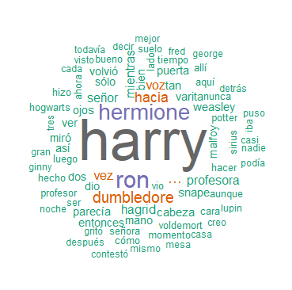

Por supuesto la palabra mas repetida es "Harry Potter", protagonista de esta saga junto con Ron y Hermione y los demas personajes presentes en toda la saga.

############################################################################## palabras ############33

## Nube de palabras para libro 1 y 3


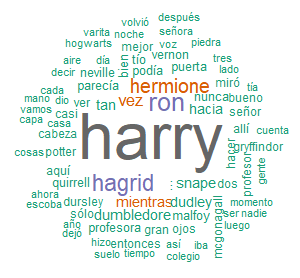   


## Graficas de frecuencia
  
# Numero de usos

```
  corpus_filtrado_ordenado8[1:13, ] %>%
    ggplot(aes(palabra, frec)) +
    geom_bar(stat = "identity", color = "black", fill = "#87CEFA") +                       
    geom_text(aes(hjust = 1.3, label = frec)) + 
    coord_flip() + 
    labs(title = "Trece palabras más frecuentes",  x = "Palabras", y = "Número de usos")
```  

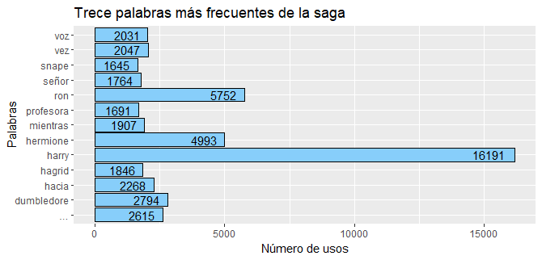

### Libro 2 y 4

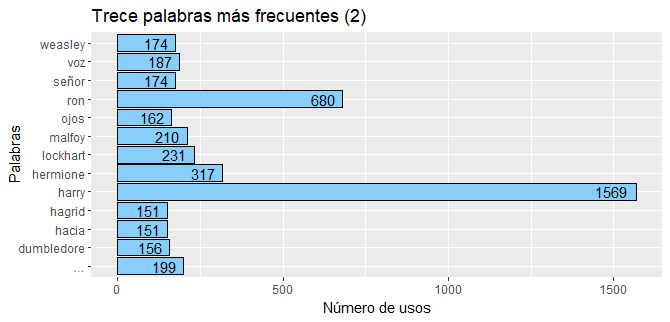

Los 3 personajes principales son los que mas se repiten asi como en la mayoria de 
las frecuuencias. En este segundo libro todavia se estan explorando personajes que 
tendran una presencia permanente. Vemos la presencia de un personaje que solo aparece en esta entrega
Lockhart. Conocer la casa de los Weasley. Voz. [ EDIT ]


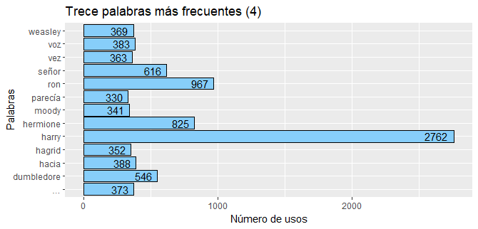

Moody nuevo personaje. El regreso de Voldemnort marcado por la aparicion de la palabra Señor


### Porcentaje de uso saga

```
  corpus_filtrado_ordenado5 %>%
    mutate(perc = (frec/sum(frec))*100) %>%
    .[1:13, ] %>%
    ggplot(aes(palabra, perc)) +
    geom_bar(stat = "identity", color = "black", fill = "#87CEFA") +                   
    geom_text(aes(hjust = 1.3, label = round(perc, 2))) + 
    coord_flip() +
    labs(title = "Trece palabras más frecuentes", x = "Palabras", y = "Porcentaje de uso")
```


### Libros 5 y 7


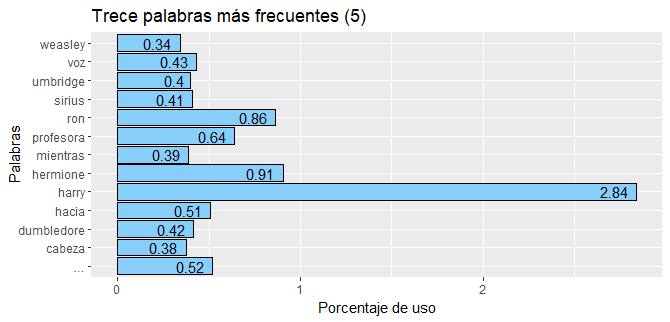

Gran presencia de profesora Umbridge y Sirius
Voz


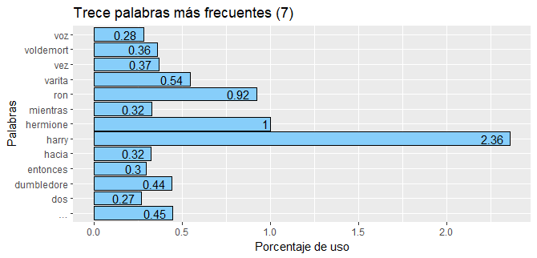

El conflicto de las varitas tiene presencia en la septima entrega. voldemort


 


### Asociaciones de palabras 

Las palabras clave y sus asociaciones a traves de toda la saga.
```
  findAssocs(tdm_8, terms = c("magia", "hogwarts", "harry", "ron", "dumbledore", "hermione", "hagrid", "snape", "voldemort", "malfoy", "potter", "varita"), corlimit = .18) 
  ```


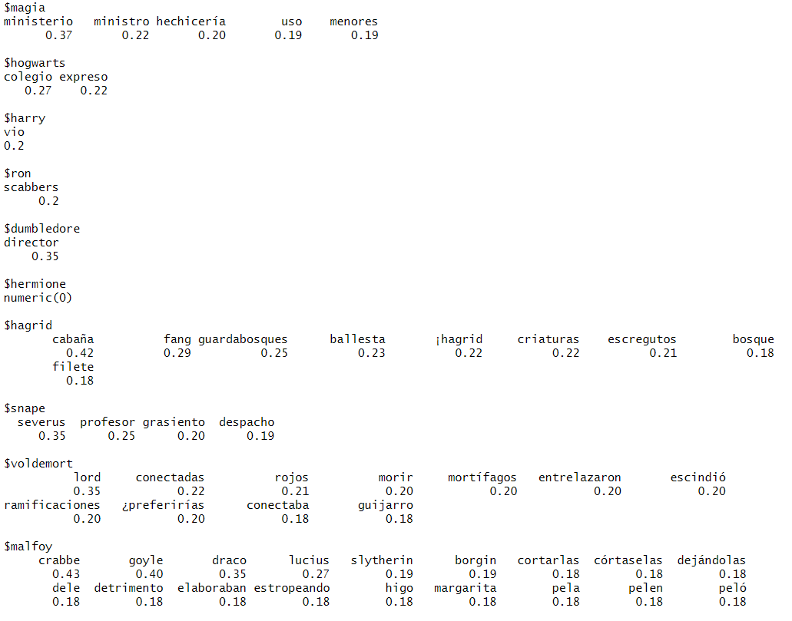


## Análisis de Redes Semánticas

  ### Modelado de Tópicos
  
 Para este modelado de topicos hare uso de LDA (Latent Dirichlet Allocation) para identificar temas latentes.
Es importante compartir este codigo para que el usuario pueda interactuar con este grafico y explorar las multiples opciones que ofrece para las relacions de esa red semantica.

 ```
  # Imprimir los temas por libro
  names(temas_por_libro) <- c("Libro1", "Libro2", "Libro3", "Libro4", "Libro5", "Libro6", "Libro7")
  
  for (libro in names(temas_por_libro)) {
    cat("\nTemas para", libro, ":\n")
    print(temas_por_libro[[libro]])
  }
  ```


  ```
  # Crear datos para visualización LDA

  datos_vis <- lapply(1:length(resultados_lda), function(i) {
    modelo <- resultados_lda[[i]]  
    dtm <- lista_dtm[[i]]  
    
    createJSON(
      phi = posterior(modelo)$terms, 
      theta = posterior(modelo)$topics,  
      doc.length = rowSums(as.matrix(dtm)),  
      vocab = colnames(as.matrix(dtm)), 
      term.frequency = colSums(as.matrix(dtm)) 
    )
  })
  
  # Visualizar para un libro (3)
  serVis(datos_vis[[3]], open.browser = TRUE)
  
```


### Harry Potter y la Orden del Fénix

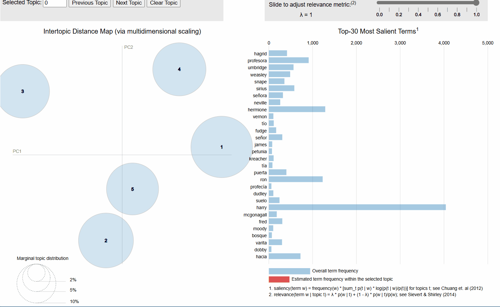

Las burbjuas de topicos varian entre las relacionadas con la profesora Umbridge que tienegran ppresencia en el libro. Muy cerca hay otra burbuja que representa la visita al bosque prohibido que tambien tiene mucho que ver con la profesora Umbrdige.
Otra es parte de lo que pasa antes de que inice el año escolar de Harry, teniendo que ver con sus tios, Sirius y todo el arco antes del comienzo del año escolar dentro de Hogwarts.
Tambien se presenta una burbuja que representa todo lo relacionado a la profecia, Neville y la visita al ministerio de Magia.
Como en cada uno de los librso el nombre de el trio protagonista se repite.


### Harry Potter y el misterio del príncipe

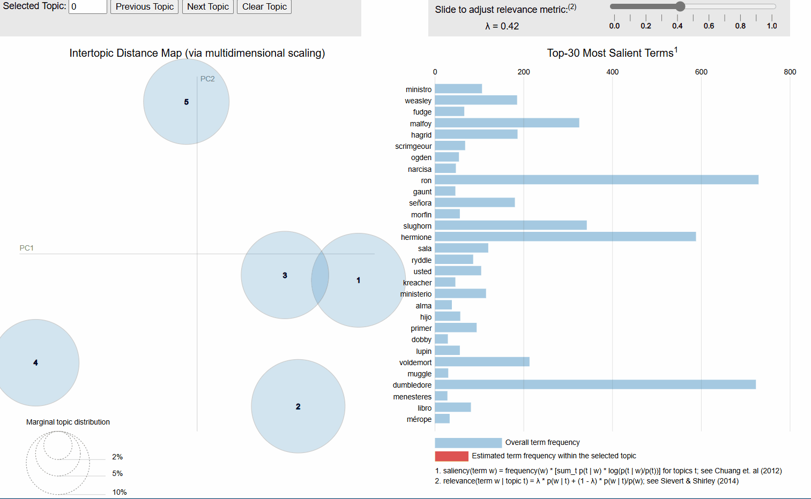

Una burbuja apartada correspondiente a la familia Gaunt y los recuerdos de Voldemort. Harry y su relacion con el
profesor Slughorn. Otra de la cabala de Hagrid y Aragog. Dos burbjuas muy juntas correspondientes a la sala de los menesteres, dobby y Malfoy. Narcisa y los Weasley.


### Harry Potter y las reliquias de la muerte

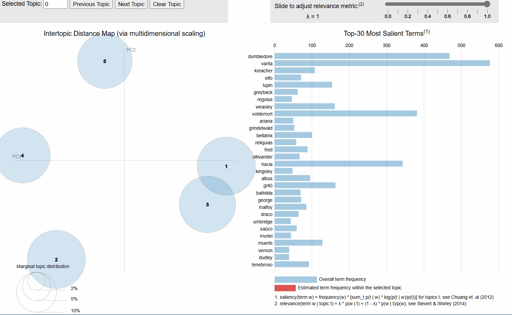

Una burbuja enlaza temas como el valle de Godric y Dumbledore.
Temas relacionados con variedad de nombres que se presentan hasta que Harry parte de casa de sus tios.
Tema relacionado con Olivander, la varita de sauco y los horrocruxes. El resto son 2 burbujas variadas que tienen que ver con kreacher, Regulus, prisioneros, iglesia, estatuas y paredes.


[ Necesito exportarlo para que se pueda interactuar con el LDA]


## Analisis de sentimientos

### Personajes principales, emociones y polaridades asociadas.

¿Qué espero obtener de este análisis?
Distribución emocional: Cómo varían las emociones (miedo, tristeza, alegría, etc.) en cada libro.
Tono general: Identificar si un libro es más positivo o negativo en términos emocionales.
Evolución narrativa: Analizar cómo las emociones cambian a lo largo de la saga, reflejando el desarrollo de la trama.

  
##  Evaluar emociones y polaridad en los textos.

```
install.packages("syuzhet")
library(syuzhet)
```

El paquete syuzhet para análisis de sentimientos incluye el lexicón NRC, que evalúa 8 emociones (alegría, tristeza, miedo, etc.) y la polaridad (positivo/negativo).

```
  resultados_emociones <- lapply(texto_libros, function(texto) {
    get_nrc_sentiment(texto)
  })
  
  # Plot Barra de columnas
  
  barplot(colSums(resultados_emociones[[8]]), las = 2, col = rainbow(10),
          main = "Distribución de emociones en la saga")
```


Se ve un proporcion de emociones relativamente equilibrada aunque se tiende a tener mas emociones negativas, probablemente representada en que los libros que presentan tematicas mas oscuras y relacionadas con la muerte son libros mas largos.

### Comparacion entre libros de la saga

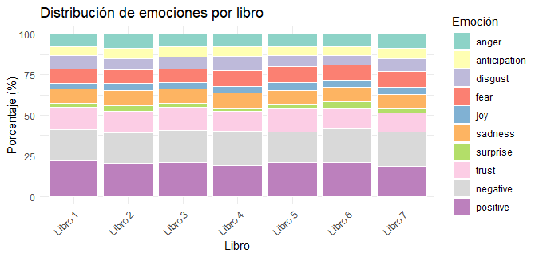

La visualización revela que un fuerte enfoque en confianza (trust) y tristeza (sadness) dominan la narrativa. Aunque hay momentos de alegría y sorpresa, son opacados por las emociones más intensas que definen el tono emocional de Harry Potter.


### Analisis de la polaridad. Comparacion entre libros:

  ```
  polaridad <- sapply(resultados_emociones, function(emociones) {
    sum(emociones$positive) - sum(emociones$negative)
  })
  
  # Plot

  barplot(polaridad, names.arg = paste("Libro", 1:8), col = "blue",
          main = "Polaridad general por libro")
```

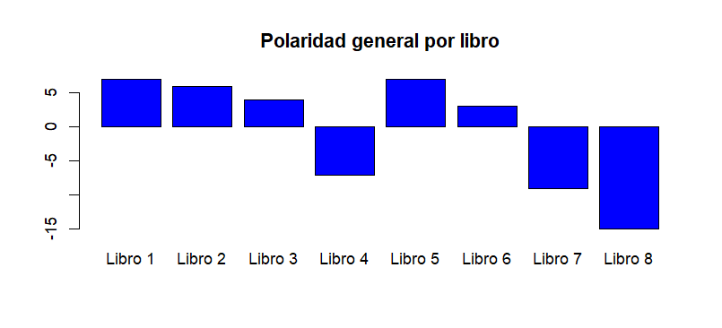

En este grafico se puede ver de manera mas explicita la diferencia entre de polaridades entre los diferentes libros.
Los 3 primeros libros son los mas positivos que gradualmente se van haciendo mas oscuros. En el 4to la diferencia es mucha, esto tiene sentido al considerar que en este libro Voldemort vuelve y se presenta la primera muerte significativa que Harry presencia, la muerte de Cedric Diggory.
* "Libro  8" representa la saga completa.


```
polaridad_libros <- data.frame(
  Polaridad = c("Positiva", "Negativa"),
  Frecuencia = colSums(do.call(cbind, lapply(resultados_emociones, function(em) em[, c("positive", "negative")]))),
  Libro = rep(paste("Libro", 1:length(librostext)), each = 2)
)

ggplot(polaridad_libros, aes(x = Libro, y = Frecuencia, fill = Polaridad)) +
  geom_bar(stat = "identity", position = "dodge") +
  scale_fill_manual(values = c("steelblue", "tomato")) +
  labs(title = "Polaridad emocional por libro",
       x = "Libro",
       y = "Frecuencia de polaridad") +
  theme_minimal()
```
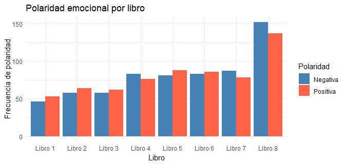

El 5to libro se presenta como uno mucho mas positivo, no hay muertes y Harry toma mas autonomia y liderazgo al crear la Orden del Fenix. El 6to libro vuelve a tener una polaridad mas negativa con respecto a su antecesor pero aun asi no tanto como el 4to. Este libro presenta tematicas mas profundas relacionadas con el pasado de Voldemort, sus recuerdos, los Horrocruxes y la muerte de Dumbledore.
Finalmente el 7to libro es el libro con la polaridad mas negativa de la saga, esto debido a que se presentan situaciones cercanas a la muerte, temas relacionados con esta y el sacrificio de parte de Harry, la destruccion de los horrocruxes, y finalmente la ballata de Hogwarts la cual presenta la mayor cantidad de muertes.

La consistencia de estas emociones refleja un patrón recurrente en la saga de Harry Potter, donde momentos oscuros se equilibran con esperanza y momentos alegres.
* El "libro 8" representa la saga completa


## Emociones por personajes 

### Grafico de pizza

```
 ggplot(datos_harry, aes(x = "", y = Frecuencia, fill = Emocion)) +
    geom_bar(stat = "identity", width = 1, color = "white") +
    coord_polar(theta = "y") +
    scale_fill_manual(values = colores_emociones) +
    geom_text(aes(label = paste0(Porcentaje, "%")), 
              position = position_stack(vjust = 0.5),  # Centrar etiquetas en los segmentos
              size = 3) +  # Tamaño de las etiquetas
    ggtitle("Distribución de emociones para Harry") +
    theme_void()
```


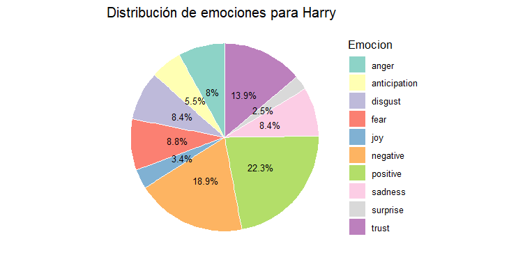

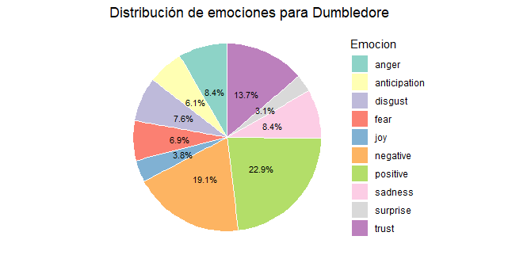

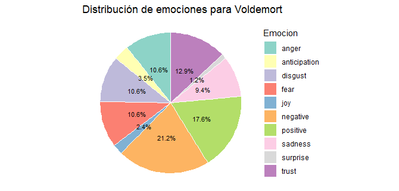

### Comparacion entre personajes principales


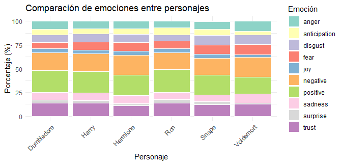


###################################################################


# 5. Compartir


Resultados
Los resultados obtenidos destacan diferencias significativas en la distribución de emociones:

Personajes principales:

Harry Potter: Dominado por emociones de tristeza y miedo.
Hermione Granger: Mayor proporción de alegría y confianza.
Voldemort: Predominan emociones negativas como ira y disgusto.
Libros:

Emociones más positivas en los libros iniciales.
Aumento de emociones negativas como miedo y tristeza hacia el final de la saga.

Conclusiones y Extensiones
Conclusiones
Las emociones reflejan la evolución temática de la saga.
Los personajes principales tienen perfiles emocionales únicos que contribuyen a su caracterización.
Extensiones Futuras
Aplicar técnicas de aprendizaje automático para clasificar emociones en frases específicas.
Analizar co-ocurrencias de emociones en diálogos clave.
Ampliar el análisis a otras sagas literarias para comparar patrones.


# Integra con tus análisis previos

Relaciona emociones con temas (LDA)
- Examina si los temas latentes identificados con LDA están asociados con emociones particulares.
Ejemplo:
 Tema "magia" puede tener más emociones de "alegría".
 Tema "oscuridad" puede asociarse con "miedo" o "tristeza".


Visualización:
ggplot2, wordcloud, igraph
Análisis avanzado:
topicmodels, syuzhet


###### describir los paqueetes usados  tipo:
library(harrypotter) # for the raw text
library(tidyverse)   # data manipulation
library(tidytext)    # for text mining

###### Que hechizos se hacen mas a lo largo de la saga? 

accio 
spelliermus
hechizos imperdonables


# 6. Actuar
