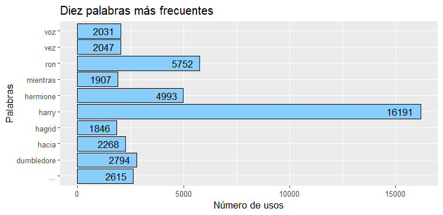
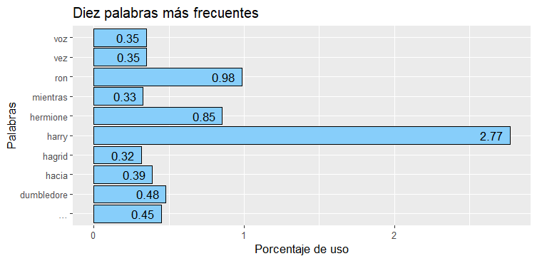
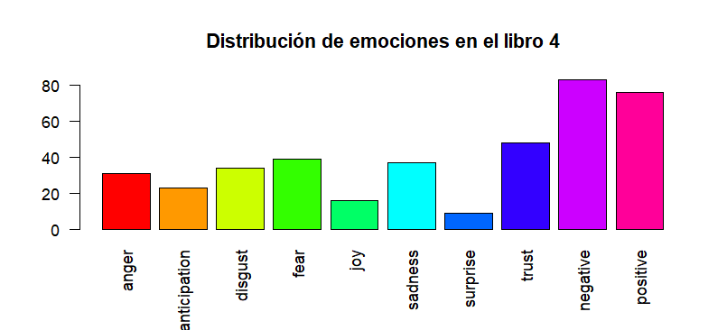
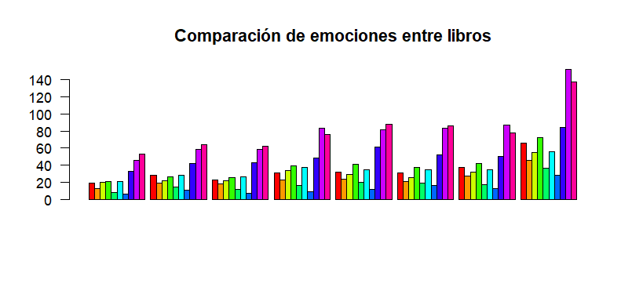

# 📚 Análisis de Texto de la Saga de Harry Potter 🧙‍♂️

[INTRO DE IMPORTANCIA E HITOS DE HP]
Harry Potter se ha logrado ahcer un lugar en la historia al convertirse en una de las sagas literarias juveniles mas famosas de todos los tiempos.
Se han adapatado los 7 libros escritos por JK rowling al cine. 

Descripción del Proyecto

Este proyecto realiza un análisis del texto completo de los siete libros de la saga Harry Potter mediante técnicas de minería de datos 
y procesamiento de lenguaje natural (PLN). El objetivo principal es extraer patrones, identificar palabras clave, explorar características 
lingüísticas y las emociones de personajes principales que permitan una comprensión más profunda de esta icónica obra literaria.

A través del uso de R y librerías especializadas, este análisis se desarrolla utilizando métodos de preprocesamiento de texto, 
extracción de temas, análisis de redes semánticas y más.

# Objetivos del Proyecto

Procesar y limpiar los textos de los libros para convertirlos en datos estructurados listos para análisis.

Identificar palabras frecuentes, temas recurrentes y asociaciones de términos clave.

Visualizar patrones en el texto mediante gráficas, nubes de palabras y diagramas. [EDIT]

Proponer nuevos enfoques analíticos, incluyendo análisis de sentimientos, modelado de tópicos y análisis de complejidad textual. [EDIT]


# 1. Preguntar

-Como cambia la saga a traves de los 7 años en que transcurre esta obra literaria?

-Cuales son los personajes que destacan en cada libro independiente de los principales?

Que palabras se asocian con ciertos personajes?  y cuales son los sentimientos que los acompañan?

-Hay algunos personajes que estan mas relacionados con ciertos sentimientos que otros?

-Que analisis extras y conclusiones podemos sacar mediante la mineria de texto aplicada en este analisis?

Analizar la frecuencia de palabras relacionadas con emociones y temas a lo largo de los capítulos.

Que topicos son los que predominan en cada libro?


# RE EVALUAR / PREGUNTAS MACROS

Cuale son los principales temas abordados por libro?

Que emociones predominan en los personajes principales a traves de toda la saga?


asociaciones DIFERNCIA?
asosaciones

# 2. Preparar


1. Preparación de Datos

Fuente de Datos: Archivos pdf de la saga de libros Harry Potter


Constituido por 8 archivo. Un archivo que contiene la saga completa y 7 archivos individuales para cada libro de la saga.

###### Nombrar todos los libros y su cantidad de paginas #################################################################

### Para preparar los datos aplicaré un Enfoque ROCCC:

Reliable/Confiablilidad: Famosa saga de libros escritos por la autora JK Rowling. 

Original/Originalidad: Datos originales obtenidos directamente de los libros

Comprehensive/Integralidad: Texto extraido de los libros de Harry Potter, saga consistente en 7 libros 

Current/Actuales: Exitosa saga estrenada en --- qe finalizo con su ultimo libro en ---

Cited/Citación: [?????????] No es necesaria

###### ################################################################################################################################################

# 3. Procesar

Preprocesamiento de Texto:
Los textos son procesados para:

La limpieza del corpus

Convertirlos a minúsculas.
Eliminar puntuación y números.
Remover palabras irrelevantes (stopwords) en español.
Crear corpora para su análisis.

Empiezo a procesar los archivos incluyendolos a una lista de pdf, para luego iterar sobre ella y crear el corpus para cada libro


```
    corpus <- Corpus(VectorSource(texto))
    corpus <- tm_map(corpus, content_transformer(tolower))
    corpus <- tm_map(corpus, removePunctuation)
    corpus <- tm_map(corpus, removeNumbers)
    corpus <- tm_map(corpus, removeWords, stopwords("spanish"))
    corpus <- tm_map(corpus, stripWhitespace)

    corpus <- tm_map(corpus, content_transformer(function(x) gsub("—", "", x)))
    corpus <- tm_map(corpus, content_transformer(function(x) gsub("—¿", "", x)))
    corpus <- tm_map(corpus, content_transformer(function(x) gsub("—¡", "", x)))
    corpus <- tm_map(corpus, content_transformer(function(x) gsub("—dijo", "", x)))
    corpus <- tm_map(corpus, content_transformer(function(x) gsub("dijo", "", x)))
    corpus <- tm_map(corpus, content_transformer(function(x) gsub("preguntó", "", x)))
```
Limpio ademas signos especiales y palabras tipicos de una narracion como esta, los cuales de seguro se repetiran mucho,
 no quiero que [---] misleading?) mi analisis


# 4. Analisis


Creo la matriz de términos-documentos para poder calcular la frecuencia de términos para cada libro.
Para ello creo un bucle para procesar cada archivo, asi no tendré que repetir el codigo para cada uno de los 8 archivos.

```
  for (i in 1:8) {
    # Crear nombres dinámicos para los objetos
    nombre_corpus <- paste0("HP_", i)
    nombre_tdm <- paste0("tdm_", i)
    nombre_frecuencia <- paste0("frecuencia_ordenada", i)
    nombre_resultado <- paste0("corpus_filtrado_ordenado", i)
    
    corpus <- get(nombre_corpus)  

    tdm <- TermDocumentMatrix(corpus)
    
    # Calcular la frecuencia de términos
    frecuencia_terminos <- rowSums(as.matrix(tdm), na.rm = TRUE)
    frecuencia_ordenada <- sort(frecuencia_terminos, decreasing = TRUE)
    
    # Crear el data frame con los términos y sus frecuencias
    resultado <- data.frame(
      palabra = names(frecuencia_ordenada),
      frec = frecuencia_ordenada
    )
    
    # Asignar los objetos
    assign(nombre_tdm, tdm)  
    assign(nombre_frecuencia, frecuencia_ordenada)  
    assign(nombre_resultado, resultado)  
  }
```
Con la frecuencia de terminos para toda la saga puedo analizar cada libro 

### Nube de palabas para corpus_filtrado_ordenado8 / toda la saga
  
```
  wordcloud(words = corpus_filtrado_ordenado8$palabra, 
            freq = corpus_filtrado_ordenado8$frec, 
            max.words = 80,                              
            random.order = F, 
            colors = brewer.pal(name = "Dark2", n = 8))
```


Por supuesto la palabra mas repetida es "Harry Potter", protagonista de esta saga.

### Graficas de frecuencia
  
  # NUMERO DE USOS. Solo cambiar el numero en corpus_filtrado_ordenado_X

```
  corpus_filtrado_ordenado8[1:10, ] %>%
    ggplot(aes(palabra, frec)) +
    geom_bar(stat = "identity", color = "black", fill = "#87CEFA") +                       
    geom_text(aes(hjust = 1.3, label = frec)) + 
    coord_flip() + 
    labs(title = "Diez palabras más frecuentes",  x = "Palabras", y = "Número de usos")
```  


### Porcentaje de uso saga
```
  corpus_filtrado_ordenado8 %>%
    mutate(perc = (frec/sum(frec))*100) %>%
    .[1:10, ] %>%
    ggplot(aes(palabra, perc)) +
    geom_bar(stat = "identity", color = "black", fill = "#87CEFA") +                   
    geom_text(aes(hjust = 1.3, label = round(perc, 2))) + 
    coord_flip() +
    labs(title = "Diez palabras más frecuentes", x = "Palabras", y = "Porcentaje de uso")
```



###### HACERLO POR LIBRO? SOLO ALGUNOS? ##################################################################################################


##  Minería de Texto Avanzada

### Análisis de Redes Semánticas:

  ### Modelado de Tópicos:
  
 Para este modelado de topicos hare Uso de LDA (Latent Dirichlet Allocation) para identificar temas latentes.
  Construcción de grafos basados en la co-ocurrencia de palabras clave.

 ```
  # Imprimir los temas por libro
  names(temas_por_libro) <- c("Libro1", "Libro2", "Libro3", "Libro4", "Libro5", "Libro6", "Libro7")
  
  for (libro in names(temas_por_libro)) {
    cat("\nTemas para", libro, ":\n")
    print(temas_por_libro[[libro]])
  }
  ```

  ```
  # Crear datos para visualización LDA

  datos_vis <- lapply(1:length(resultados_lda), function(i) {
    modelo <- resultados_lda[[i]]  # Seleccionar el modelo actual
    dtm <- lista_dtm[[i]]  # DTM correspondiente al modelo actual
    
    createJSON(
      phi = posterior(modelo)$terms, 
      theta = posterior(modelo)$topics,  
      doc.length = rowSums(as.matrix(dtm)),  
      vocab = colnames(as.matrix(dtm)), 
      term.frequency = colSums(as.matrix(dtm)) 
    )
  })
  
  # Visualizar para un libro
  serVis(datos_vis[[3]], open.browser = TRUE)
  
```

###### VISUALIZACION EN GIF? O TIRAS DE IMAGENES O ALOJAR EN UNA PAGINA GITHUB PARA QUE EL USUARIO INTERACTUE CON ELLA?
# HACER LA INTERACCION GUIADA EN EL GIF?


# ASOCIACIONES ENTRE palabras. Cambiar palabras  #####################################################
  
findAssocs(tdm_8, terms = c("harry"), corlimit = .15) 
  
# A QUE PALABRAS APLICARLO?? ############ DEBO EVALUARLO DESPUES DE CORRER EL LDA PARA TODOS LOS LIBROS, QUIZA HAGA SENTIDO 
# ANALIZAR CORRELACIONES DE PALABRAS CLAVES.


  
# ANALISIS DE SENTIMIENTOS:

#### Personajes principales y emociones y polaridades asociadas.


¿Qué puedes obtener de este análisis?
Distribución emocional: Cómo varían las emociones (miedo, tristeza, alegría, etc.) en cada libro.
Tono general: Identificar si un libro es más positivo o negativo en términos emocionales.
Evolución narrativa: Analizar cómo las emociones cambian a lo largo de la saga, reflejando el desarrollo de la trama.

  
  # Evaluar emociones y polaridad en los textos.
  
 
  library(syuzhet)

  El análisis de sentimientos con el paquete syuzhet puede complementar tu trabajo actual al explorar
las emociones y polaridades presentes en los textos

El paquete syuzhet incluye el lexicón NRC, que evalúa 8 emociones (alegría, tristeza, miedo, etc.) y la polaridad (positivo/negativo).


  resultados_emociones <- lapply(texto_libros, function(texto) {
    get_nrc_sentiment(texto)
  })
  
  # Plot Barra de columnas
  
  barplot(colSums(resultados_emociones[[1]]), las = 2, col = rainbow(10),
          main = "Distribución de emociones en el libro 1")
  
  barplot(colSums(resultados_emociones[[4]]), las = 2, col = rainbow(10),
          main = "Distribución de emociones en el libro 4")
  
  barplot(colSums(resultados_emociones[[7]]), las = 2, col = rainbow(10),
          main = "Distribución de emociones en el libro 7")
  
  barplot(colSums(resultados_emociones[[8]]), las = 2, col = rainbow(10),
          main = "Distribución de emociones en la saga")





 # Analisis de la polaridad. Comparacion entre libros:
  
  polaridad <- sapply(resultados_emociones, function(emociones) {
    sum(emociones$positive) - sum(emociones$negative)
  })
  
  #plot:
  
  barplot(polaridad, names.arg = paste("Libro", 1:8), col = "blue",
          main = "Polaridad general por libro")
  


### Como se puede ver la progresion de los libros hacia tematicas mas oscuras y negativas. [ big chiet]


###################################################################


# Integra con tus análisis previos

Relaciona emociones con temas (LDA)
- Examina si los temas latentes identificados con LDA están asociados con emociones particulares.
Ejemplo:
 Tema "magia" puede tener más emociones de "alegría".
 Tema "oscuridad" puede asociarse con "miedo" o "tristeza".


Visualización:
ggplot2, wordcloud, igraph
Análisis avanzado:
topicmodels, syuzhet


